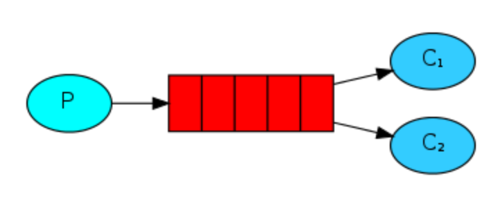

# Work Queues
Distributing tasks among workers. This is a bit more complex.

# Setup
- establish a connection to the host
- create a channel from the connection
- declare a durable queue from the channel

# Sender
- use channel.basic_publish to send a message, specifying the exchange as '', routing_key as the queue name, and the message

# Receivers (workers)
- use channel.basic_qos to set a prefetch_count of 1, guaranteeing that each workwer will work on 1 thing at a time. 
- call channel.basic_consume with the queue name, the callback, and setting auto_ack to False. This requires the callback to ack the message, or it will be resent to another worker eventually.

# Examples
## Rust
The rust implementation uses std::