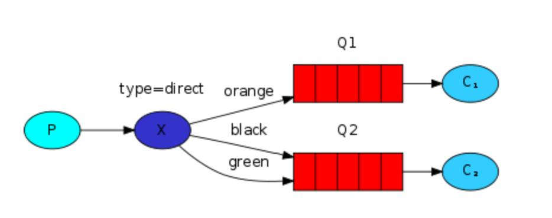

# Routing
Example of how to selectively publish / subscribe using a direct exchange. In a direct exchange, a message goes to teh queues whose `binding key` exactly matchs the `routing key` of the message.
Each queue may have any number of binding keys. As an example, given a direct exchange with two queues bound to it - the first one may listen for any routing key matching any log level (info, warn, error), and the second may only be interested in one (error)

