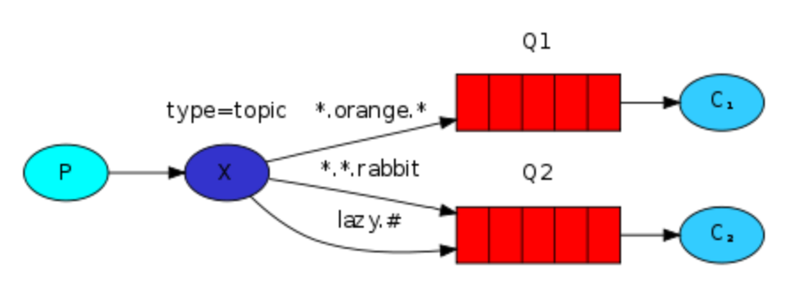

# Topics
The direct exchange has at least one big limitation; it cannot do routing based on multiple criteria. To overcome this, we can use the `topic` exchange.

Messages to a `topic` exchange must have `routing key`s consisting of a list of words delimited with periods. The words usually specify some hierchy of features. For example `stock.usd.nyse`, `quick.orange.rabbit`. There can be as many words in the routing as you like, up to a limit of 255 bytes. (question about encoding. Ascii or? if ascii that is 255 chars)

The `binding key` has the same constraints as the `routing key`. However, there are two important special characters for the `binding key`:
- `*` (star) globs a single word
- `#` (hash) globs zero or more words



## Notes
The `topic` exchange is powerful in that it cna behave like other exchanges
- When a queue is bound with a `# binding key`, it behaves like a `fanout` exchange
- When special characters `#` and `*` aren't used in the bindings, the topic exchange will behave like a `direct` exchange

## python example
Set up some recievers

This receiver is concerned with warnings and errors regardless of their source.
```bash
receive_logs.py "*.warn" "*.error"
```

This one is concerned with all messages for portland
```bash
receive_logs.py "portland.*"
```

this one receives all logs
```bash
receive_logs.py "#"
```