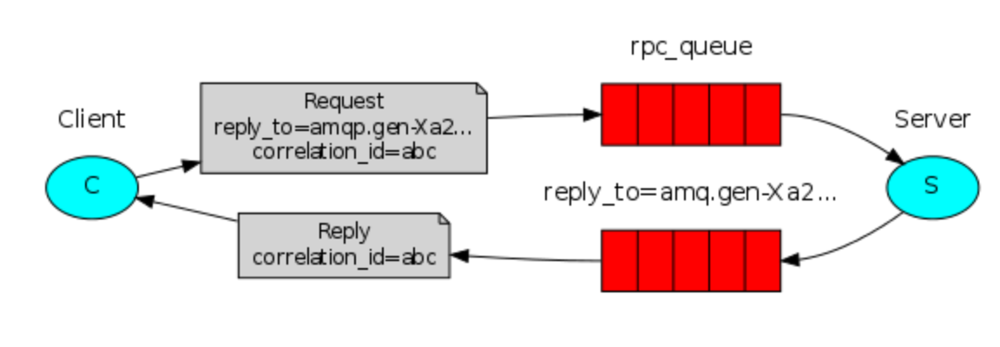

# RPC
What if we need to run a procedure on a remote computer and wait for the result?
We are going to build a fibonacci server.

For sending data back, we need to set up a callback queue to handle this. 

# Future questions
- How shoudl teh client react if there are no servers running?
- should client have some sort of timeout?